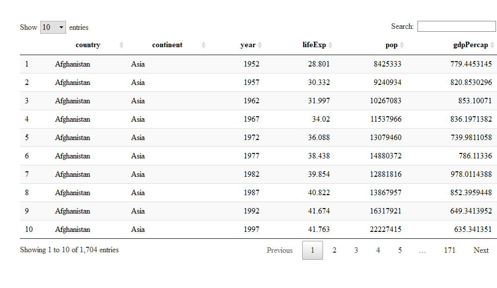

hw01\_gapminder (Exercise 2)
================
by Julie Park
September 16, 2019

<br/>

Simple overview of the data
---------------------------

``` r
str(gapminder)
```

    ## Classes 'tbl_df', 'tbl' and 'data.frame':    1704 obs. of  6 variables:
    ##  $ country  : Factor w/ 142 levels "Afghanistan",..: 1 1 1 1 1 1 1 1 1 1 ...
    ##  $ continent: Factor w/ 5 levels "Africa","Americas",..: 3 3 3 3 3 3 3 3 3 3 ...
    ##  $ year     : int  1952 1957 1962 1967 1972 1977 1982 1987 1992 1997 ...
    ##  $ lifeExp  : num  28.8 30.3 32 34 36.1 ...
    ##  $ pop      : int  8425333 9240934 10267083 11537966 13079460 14880372 12881816 13867957 16317921 22227415 ...
    ##  $ gdpPercap: num  779 821 853 836 740 ...

<br/><br/>

3 ways to actually print out gapminder data:
--------------------------------------------

### 1. Convert it as data.frame and use head function

``` r
newdat<-data.frame(gapminder)
print(paste("Number of rows & columns:", paste(dim(newdat),collapse=', ')))
```

    ## [1] "Number of rows & columns: 1704, 6"

``` r
head(newdat)
```

    ##       country continent year lifeExp      pop gdpPercap
    ## 1 Afghanistan      Asia 1952  28.801  8425333  779.4453
    ## 2 Afghanistan      Asia 1957  30.332  9240934  820.8530
    ## 3 Afghanistan      Asia 1962  31.997 10267083  853.1007
    ## 4 Afghanistan      Asia 1967  34.020 11537966  836.1971
    ## 5 Afghanistan      Asia 1972  36.088 13079460  739.9811
    ## 6 Afghanistan      Asia 1977  38.438 14880372  786.1134

<br/>

### 2. Print out a tibble object

``` r
gapminder
```

    ## # A tibble: 1,704 x 6
    ##    country     continent  year lifeExp      pop gdpPercap
    ##    <fct>       <fct>     <int>   <dbl>    <int>     <dbl>
    ##  1 Afghanistan Asia       1952    28.8  8425333      779.
    ##  2 Afghanistan Asia       1957    30.3  9240934      821.
    ##  3 Afghanistan Asia       1962    32.0 10267083      853.
    ##  4 Afghanistan Asia       1967    34.0 11537966      836.
    ##  5 Afghanistan Asia       1972    36.1 13079460      740.
    ##  6 Afghanistan Asia       1977    38.4 14880372      786.
    ##  7 Afghanistan Asia       1982    39.9 12881816      978.
    ##  8 Afghanistan Asia       1987    40.8 13867957      852.
    ##  9 Afghanistan Asia       1992    41.7 16317921      649.
    ## 10 Afghanistan Asia       1997    41.8 22227415      635.
    ## # ... with 1,694 more rows

<br/>

### 3. Use datatable function

``` r
datatable(gapminder)
```


