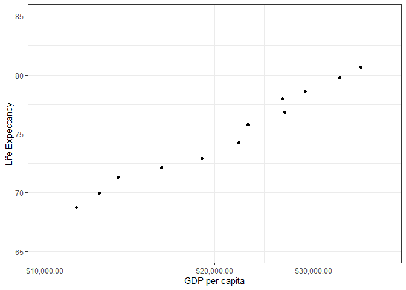
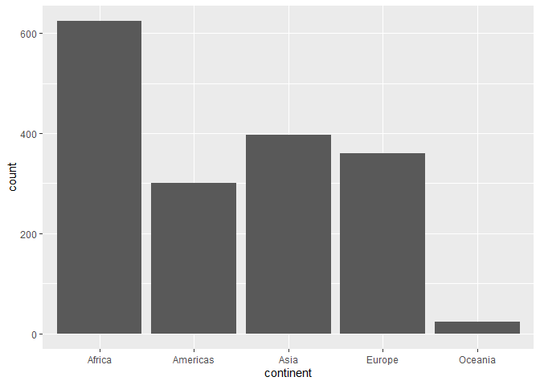
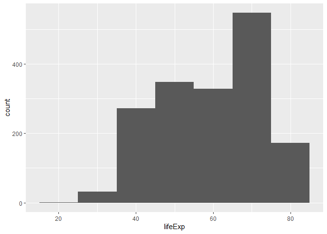
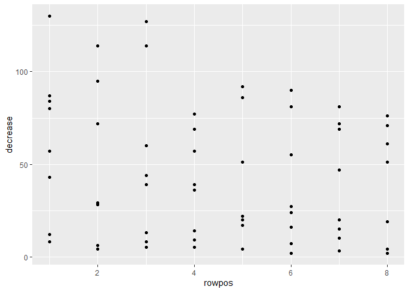
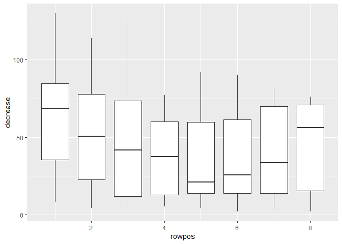

hw02
================
by Julie Park
September 22, 2019

    ## -- Attaching packages --------------------------------------- tidyverse 1.2.1 --

    ## v ggplot2 3.2.0     v purrr   0.3.2
    ## v tibble  2.1.3     v dplyr   0.8.1
    ## v tidyr   0.8.3     v stringr 1.4.0
    ## v readr   1.3.1     v forcats 0.4.0

    ## -- Conflicts ------------------------------------------ tidyverse_conflicts() --
    ## x dplyr::filter() masks stats::filter()
    ## x dplyr::lag()    masks stats::lag()

Exercise 1: Basic dplyr
=======================

1.1
---

Use filter() to subset the gapminder data to 3 countries of your choice in the 1970's.

``` r
gapminder %>% 
  filter(year %in% 1970:1979 & country %in% c('Chad','Romania','Spain'))
```

    ## # A tibble: 6 x 6
    ##   country continent  year lifeExp      pop gdpPercap
    ##   <fct>   <fct>     <int>   <dbl>    <int>     <dbl>
    ## 1 Chad    Africa     1972    45.6  3899068     1104.
    ## 2 Chad    Africa     1977    47.4  4388260     1134.
    ## 3 Romania Europe     1972    69.2 20662648     8011.
    ## 4 Romania Europe     1977    69.5 21658597     9356.
    ## 5 Spain   Europe     1972    73.1 34513161    10639.
    ## 6 Spain   Europe     1977    74.4 36439000    13237.

<br/>

1.2
---

Use the pipe operator %&gt;% to select "country" and "gdpPercap" from your filtered dataset in 1.1.

``` r
gapminder %>% 
  filter(year %in% 1970:1979 & country %in% c('Chad','Romania','Spain'))%>%
  select(country, gdpPercap)
```

    ## # A tibble: 6 x 2
    ##   country gdpPercap
    ##   <fct>       <dbl>
    ## 1 Chad        1104.
    ## 2 Chad        1134.
    ## 3 Romania     8011.
    ## 4 Romania     9356.
    ## 5 Spain      10639.
    ## 6 Spain      13237.

<br/>

1.3
---

Filter gapminder to all entries that have experienced a drop in life expectancy. Be sure to include a new variable that's the increase in life expectancy in your tibble.

The following steps will be taken for exercise 1.3:

1.  Make sure the year is in asending order within each country, using group\_by() and arrange().
2.  Obtain the lifeExp of the previous year, called prev\_lifeExp, using mutate().
3.  Obtain the change from the previous year, using mutate()
4.  Select the entries that have experienced a drop in life expectancy compared to the year before, using filter()

``` r
gapminder %>% group_by(country) %>% arrange(year) %>% 
  mutate(prev_lifeExp=lag(lifeExp), change=lifeExp-prev_lifeExp) %>% 
  filter(change<0)
```

    ## # A tibble: 102 x 8
    ## # Groups:   country [52]
    ##    country    continent  year lifeExp    pop gdpPercap prev_lifeExp  change
    ##    <fct>      <fct>     <int>   <dbl>  <int>     <dbl>        <dbl>   <dbl>
    ##  1 China      Asia       1962    44.5 6.66e8      488.         50.5 -6.05  
    ##  2 Cambodia   Asia       1972    40.3 7.45e6      422.         45.4 -5.10  
    ##  3 Czech Rep~ Europe     1972    70.3 9.86e6    13108.         70.4 -0.0900
    ##  4 Netherlan~ Europe     1972    73.8 1.33e7    18795.         73.8 -0.0700
    ##  5 Slovak Re~ Europe     1972    70.4 4.59e6     9674.         71.0 -0.63  
    ##  6 Bulgaria   Europe     1977    70.8 8.80e6     7612.         70.9 -0.09  
    ##  7 Cambodia   Asia       1977    31.2 6.98e6      525.         40.3 -9.10  
    ##  8 El Salvad~ Americas   1977    56.7 4.28e6     5139.         58.2 -1.51  
    ##  9 Poland     Europe     1977    70.7 3.46e7     9508.         70.8 -0.180 
    ## 10 Uganda     Africa     1977    50.4 1.15e7      844.         51.0 -0.666 
    ## # ... with 92 more rows

<br/>

1.4
---

Filter gapminder so that it shows the max GDP per capita experienced by each country.

``` r
gapminder %>% group_by(country) %>% filter(gdpPercap==max(gdpPercap))
```

    ## # A tibble: 142 x 6
    ## # Groups:   country [142]
    ##    country     continent  year lifeExp       pop gdpPercap
    ##    <fct>       <fct>     <int>   <dbl>     <int>     <dbl>
    ##  1 Afghanistan Asia       1982    39.9  12881816      978.
    ##  2 Albania     Europe     2007    76.4   3600523     5937.
    ##  3 Algeria     Africa     2007    72.3  33333216     6223.
    ##  4 Angola      Africa     1967    36.0   5247469     5523.
    ##  5 Argentina   Americas   2007    75.3  40301927    12779.
    ##  6 Australia   Oceania    2007    81.2  20434176    34435.
    ##  7 Austria     Europe     2007    79.8   8199783    36126.
    ##  8 Bahrain     Asia       2007    75.6    708573    29796.
    ##  9 Bangladesh  Asia       2007    64.1 150448339     1391.
    ## 10 Belgium     Europe     2007    79.4  10392226    33693.
    ## # ... with 132 more rows

</br>

1.5
---

Produce a scatterplot of Canada's life expectancy vs. GDP per capita

``` r
gapminder %>% filter(country=='Canada') %>% 
  ggplot(aes(gdpPercap, lifeExp)) +
  geom_point() +
  scale_x_log10("GDP per capita", labels = scales::dollar_format(), limits=c(10000,40000)) +
  theme_bw() +
  ylab("Life Expectancy") + ylim(c(65,85))
```



<br/><br/>

Exercise 2. Explore individual variables with dplyr
===================================================

One categorical variable (continent) and one continuous variable (lifeExp) were chosen for data exploration.
------------------------------------------------------------------------------------------------------------

<br/>

2.1 Explore a categorical variable: continent
---------------------------------------------

Africa counts 37% (n=624 rows) of the data entries, followed by Asia (n=396; 23%), Europe (n=360; 21%), Americas (n=300, 18%) and Oceania (n=24; 1%).

``` r
gapminder %>% count(continent) %>% mutate('%'=round(100*n/sum(n))) 
```

    ## # A tibble: 5 x 3
    ##   continent     n   `%`
    ##   <fct>     <int> <dbl>
    ## 1 Africa      624    37
    ## 2 Americas    300    18
    ## 3 Asia        396    23
    ## 4 Europe      360    21
    ## 5 Oceania      24     1

Barplots below show the relative difference visually.

``` r
gapminder %>% 
  ggplot(mapping=aes(x=continent))+geom_bar()
```



<br/>

2.2 Explore a continuous variable: lifeExp
------------------------------------------

As shown in the histogram below, the distribution of life expectancy (lifeExp) is not normally distributed. The median value is 60.71 years with the interquartile range of 48.20 and 70.85. The mean value is 59.47, which was slightly lower than the median value.

``` r
summary(gapminder$lifeExp)
```

    ##    Min. 1st Qu.  Median    Mean 3rd Qu.    Max. 
    ##   23.60   48.20   60.71   59.47   70.85   82.60

``` r
gapminder %>% ggplot(aes(x=lifeExp))+geom_histogram(binwidth=10,center=0)
```



When this continuous variable is categorized into deciles, 70-80 years are the most frequent interval of life expectancy of a country.

``` 4
 table(cut(gapminder$lifeExp,breaks=seq(20,90,10)))
```

<br/><br/>

Exercise 3. Explore various plot types
======================================

3.1 A scatterplot of two quantitative variables
-----------------------------------------------

``` r
ggplot(OrchardSprays,aes(rowpos,decrease))+geom_point()
```



3.2 A box plot
--------------

Since rowpos is an integer, and takes distinct values, it can be considered as a categorical variable; a boxplot is created.

``` r
OrchardSprays %>% 
ggplot()+geom_boxplot(aes(rowpos,decrease,group=cut_width(rowpos,1)))
```


