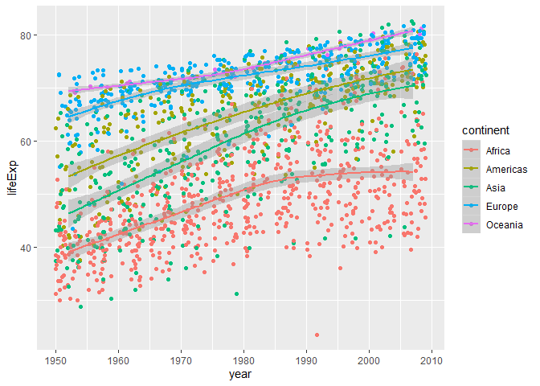
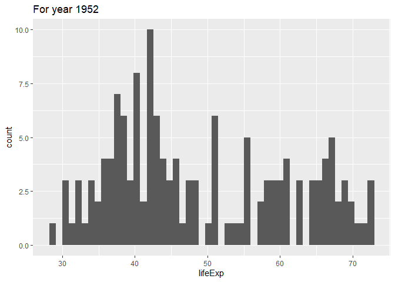
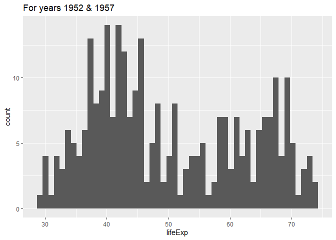
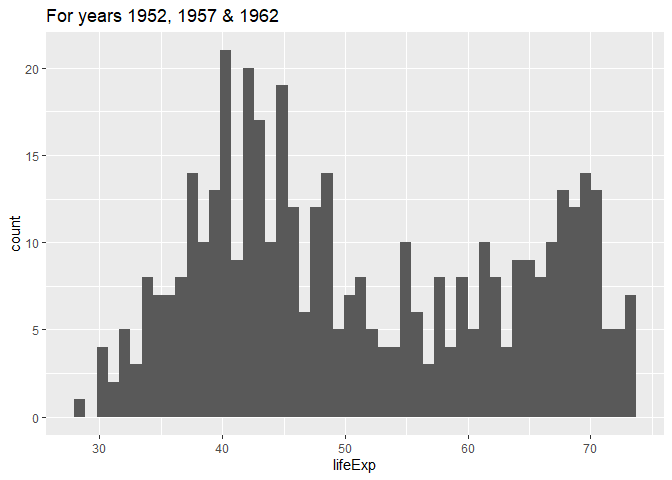
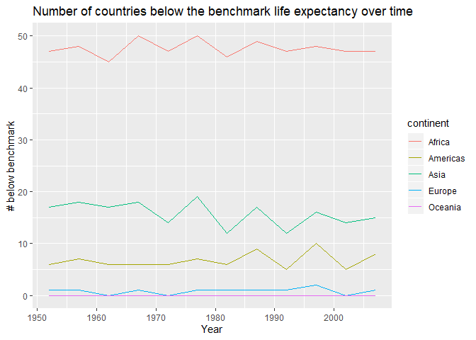
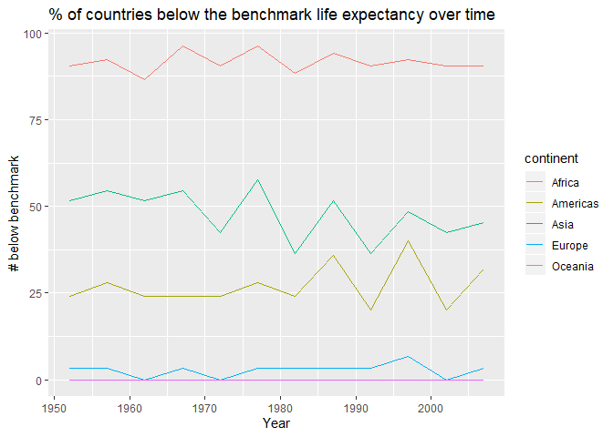
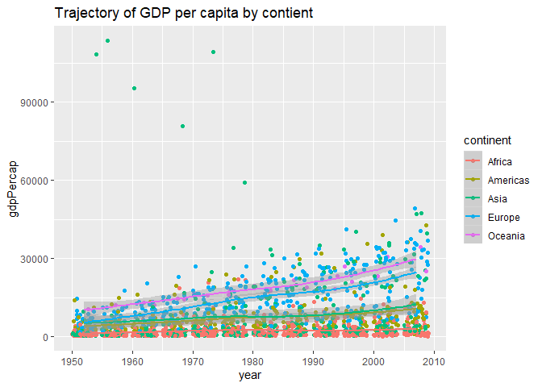
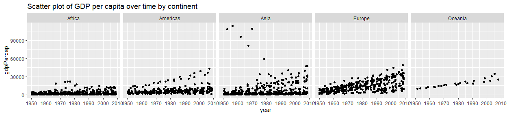
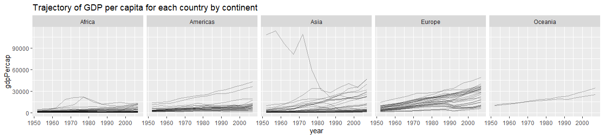

# Task Option 1
Report the absolute and/or relative abundance of countries with low life expectancy over time by continent: Compute some measure of worldwide life expectancy – you decide – a mean or median or some other quantile or perhaps your current age. Then determine how many countries on each continent have a life expectancy less than this benchmark, for each year.

__Steps taken:__

1. Perform the exploratory analysis (EDA) to determine which benchmark to use.
2. Manipulate data to create lifeExp2 (i.e. below/above benchmark)
3. Generate figures to show the results.

### 1.1 EDA
Based on the plot below, we can tell (i) the life expectancy has increased over time, with a fairly similar trajectory across all continents except for Africa, where the life expectancy plateaued around 1990s, and (ii) the life expectancy differed quite a bit by continent.  

```r
p1<-gapminder %>% ggplot(aes(year,lifeExp)) + geom_jitter(aes(color=continent)) + geom_smooth(aes(color=continent))

suppressMessages(print(p1))
```

<!-- -->

Therefore, it would be reasonable to choose a benchmark that differed over time.  The remaining questions were (i) which statistic (e.g. mean vs. mean) should be chosen as a benchmark, and (ii) how often a benchmark should be updated (e.g. annual benchmark or a benchmark by a decade)?  Annual benchmark was not favoured because choosing a benchmark based on data from a single year was subject to a high variability.  A bigger bin (e.g. 10 or 15 years) was considered, instead.

In order to answer these questions, the following histograms were generated.

```r
gapminder %>% filter(year==1952) %>% ggplot(aes(lifeExp))+geom_histogram(bins=50) + labs(title='For year 1952')
```

<!-- -->

```r
gapminder %>% filter(year%in%1952:1957) %>%  ggplot(aes(lifeExp))+geom_histogram(bins=50) + labs(title='For years 1952 & 1957')
```

<!-- -->

```r
gapminder %>% filter(year%in%1952:1962) %>%  ggplot(aes(lifeExp))+geom_histogram(bins=50) + labs(title='For years 1952, 1957 & 1962')
```

<!-- -->

```r
#gapminder %>% filter(year%in%1952:1957 & continent!='Africa') %>%  ggplot(aes(lifeExp))+geom_histogram()
```

The histograms showed that the life expectancy had a bi-modal distribution (i.e. mean is not a good choice).  The first hump was mainly due to the countries in Africa (graph not shown).  As more years of data were added, the second hump became more pronounced. A decade seemed to be a good starting interval of choice.  Therefore, a median (50th percentile) by decade was selected as a benchmark.  Note that the same benchmark would be applied across all continents.  Also, even of a benchmark value was chosen to remain constant within each decade, the boolean value (above/below benchmark) was created for each year (i.e each row of the original data).


The actual values of these benchmarks were summarized in the table below:

```r
bm<-gapminder %>% mutate(Decade=paste(signif(year,digit=3),'s',sep='')) %>% group_by(Decade) %>% summarize(Benchmark=median(lifeExp))
kable(bm)
```


Decade    Benchmark
-------  ----------
1950s       45.1355
1960s       49.4520
1970s       55.6185
1980s       61.2525
1990s       66.4580
2000s       69.8560
2010s       71.9355

<br/> 

### 1.2 Data manipulation
Now the benchmark is chosen, the life expectancy can be binarized (i.e. above/below the benchmark).  However, first, the benchmark value needed to be added back to the orignal data, using SQL.


```r
tmp<-gapminder %>% mutate(Decade=paste(signif(year,digit=3),'s',sep='')) 
gapminder1<-as_tibble(
            sqldf('select a.*,b.Benchmark from tmp as a left join 
                          bm as b on a.Decade=b.Decade'))
kable(gapminder1[1:10,])
```


country       continent    year   lifeExp        pop   gdpPercap  Decade    Benchmark
------------  ----------  -----  --------  ---------  ----------  -------  ----------
Afghanistan   Asia         1952    28.801    8425333    779.4453  1950s       45.1355
Afghanistan   Asia         1957    30.332    9240934    820.8530  1960s       49.4520
Afghanistan   Asia         1962    31.997   10267083    853.1007  1960s       49.4520
Afghanistan   Asia         1967    34.020   11537966    836.1971  1970s       55.6185
Afghanistan   Asia         1972    36.088   13079460    739.9811  1970s       55.6185
Afghanistan   Asia         1977    38.438   14880372    786.1134  1980s       61.2525
Afghanistan   Asia         1982    39.854   12881816    978.0114  1980s       61.2525
Afghanistan   Asia         1987    40.822   13867957    852.3959  1990s       66.4580
Afghanistan   Asia         1992    41.674   16317921    649.3414  1990s       66.4580
Afghanistan   Asia         1997    41.763   22227415    635.3414  2000s       69.8560

Then a new variable called lifeExp2 (i.e. above/below the benchmark) was created first to create 2 additional variables: N_lt_benchmark for counts and Percent_lt_benchmark for % of N_lt_benchmark within each continent per year.

```r
out1<-
gapminder1 %>% mutate(lifeExp2=lifeExp<Benchmark) %>% group_by(continent,year) %>% summarize(N_lt_benchmark=sum(lifeExp2), N_total=n(), Percent_lt_benchmark=round(100*mean(lifeExp2),2)) 
datatable(out1)
```

<!--html_preserve--><div id="htmlwidget-0a98a98221e9390ad875" style="width:100%;height:auto;" class="datatables html-widget"></div>
<script type="application/json" data-for="htmlwidget-0a98a98221e9390ad875">{"x":{"filter":"none","data":[["1","2","3","4","5","6","7","8","9","10","11","12","13","14","15","16","17","18","19","20","21","22","23","24","25","26","27","28","29","30","31","32","33","34","35","36","37","38","39","40","41","42","43","44","45","46","47","48","49","50","51","52","53","54","55","56","57","58","59","60"],["Africa","Africa","Africa","Africa","Africa","Africa","Africa","Africa","Africa","Africa","Africa","Africa","Americas","Americas","Americas","Americas","Americas","Americas","Americas","Americas","Americas","Americas","Americas","Americas","Asia","Asia","Asia","Asia","Asia","Asia","Asia","Asia","Asia","Asia","Asia","Asia","Europe","Europe","Europe","Europe","Europe","Europe","Europe","Europe","Europe","Europe","Europe","Europe","Oceania","Oceania","Oceania","Oceania","Oceania","Oceania","Oceania","Oceania","Oceania","Oceania","Oceania","Oceania"],[1952,1957,1962,1967,1972,1977,1982,1987,1992,1997,2002,2007,1952,1957,1962,1967,1972,1977,1982,1987,1992,1997,2002,2007,1952,1957,1962,1967,1972,1977,1982,1987,1992,1997,2002,2007,1952,1957,1962,1967,1972,1977,1982,1987,1992,1997,2002,2007,1952,1957,1962,1967,1972,1977,1982,1987,1992,1997,2002,2007],[47,48,45,50,47,50,46,49,47,48,47,47,6,7,6,6,6,7,6,9,5,10,5,8,17,18,17,18,14,19,12,17,12,16,14,15,1,1,0,1,0,1,1,1,1,2,0,1,0,0,0,0,0,0,0,0,0,0,0,0],[52,52,52,52,52,52,52,52,52,52,52,52,25,25,25,25,25,25,25,25,25,25,25,25,33,33,33,33,33,33,33,33,33,33,33,33,30,30,30,30,30,30,30,30,30,30,30,30,2,2,2,2,2,2,2,2,2,2,2,2],[90.38,92.31,86.54,96.15,90.38,96.15,88.46,94.23,90.38,92.31,90.38,90.38,24,28,24,24,24,28,24,36,20,40,20,32,51.52,54.55,51.52,54.55,42.42,57.58,36.36,51.52,36.36,48.48,42.42,45.45,3.33,3.33,0,3.33,0,3.33,3.33,3.33,3.33,6.67,0,3.33,0,0,0,0,0,0,0,0,0,0,0,0]],"container":"<table class=\"display\">\n  <thead>\n    <tr>\n      <th> <\/th>\n      <th>continent<\/th>\n      <th>year<\/th>\n      <th>N_lt_benchmark<\/th>\n      <th>N_total<\/th>\n      <th>Percent_lt_benchmark<\/th>\n    <\/tr>\n  <\/thead>\n<\/table>","options":{"columnDefs":[{"className":"dt-right","targets":[2,3,4,5]},{"orderable":false,"targets":0}],"order":[],"autoWidth":false,"orderClasses":false}},"evals":[],"jsHooks":[]}</script><!--/html_preserve-->

<br/> 

### 1.3 Visualization
The first graph showed the actual number of countries that fell below the benchmark by contient.  However, a more informative summary statistic would be the percentage of countries within each continent that fell below the benchmark (2nd figure).

```r
out1 %>% ggplot(aes(year,N_lt_benchmark,color=continent))+geom_line()+ labs(title='Number of countries below the benchmark life expectancy over time', x='Year',y='# below benchmark')
```

<!-- -->

```r
out1 %>% ggplot(aes(year,Percent_lt_benchmark,color=continent))+geom_line()+labs(title='% of countries below the benchmark life expectancy over time', x='Year',y='# below benchmark')
```

<!-- -->


<br/> <br/>

# Task Option 2. Get the maximum and minimum of GDP per capita for all continents.

The crude look at the data:

```r
out2<-gapminder %>% group_by(continent) %>% summarize(Maximum=max(gdpPercap), Minimum=min(gdpPercap))
kable(out2)
```


continent      Maximum      Minimum
----------  ----------  -----------
Africa        21951.21     241.1659
Americas      42951.65    1201.6372
Asia         113523.13     331.0000
Europe        49357.19     973.5332
Oceania       34435.37   10039.5956

However, what about temporal changes?  Do we want to report maximum and minimum only by continent or also by year?

```r
p2<-
gapminder %>% ggplot(aes(year,gdpPercap,color=continent))+ geom_jitter() + geom_smooth() + labs(title='Trajectory of GDP per capita by contient')

suppressMessages(print(p2))
```

<!-- -->

There has been an increase in GDP per capita over the years; therefore, it would be more informative to report GDP per capita by continent and year.  In addition, a couple of extreme outliers were noted, all belonging to Asia.  A closer look at these extreme values (table below) showed that they were entries from Kuwait, from 1952 to 1977.

```r
kable(gapminder %>% filter(gdpPercap>59000))
```


country   continent    year   lifeExp       pop   gdpPercap
--------  ----------  -----  --------  --------  ----------
Kuwait    Asia         1952    55.565    160000   108382.35
Kuwait    Asia         1957    58.033    212846   113523.13
Kuwait    Asia         1962    60.470    358266    95458.11
Kuwait    Asia         1967    64.624    575003    80894.88
Kuwait    Asia         1972    67.712    841934   109347.87
Kuwait    Asia         1977    69.343   1140357    59265.48

The minimum/maximum of GDP per Capita could be summarized by continent and by year.


```r
out21<-gapminder %>% group_by(continent,year) %>% summarize(Maximum=max(gdpPercap), Minimum=min(gdpPercap))
datatable(out21)
```

<!--html_preserve--><div id="htmlwidget-ed5c3feb68625c4d23f3" style="width:100%;height:auto;" class="datatables html-widget"></div>
<script type="application/json" data-for="htmlwidget-ed5c3feb68625c4d23f3">{"x":{"filter":"none","data":[["1","2","3","4","5","6","7","8","9","10","11","12","13","14","15","16","17","18","19","20","21","22","23","24","25","26","27","28","29","30","31","32","33","34","35","36","37","38","39","40","41","42","43","44","45","46","47","48","49","50","51","52","53","54","55","56","57","58","59","60"],["Africa","Africa","Africa","Africa","Africa","Africa","Africa","Africa","Africa","Africa","Africa","Africa","Americas","Americas","Americas","Americas","Americas","Americas","Americas","Americas","Americas","Americas","Americas","Americas","Asia","Asia","Asia","Asia","Asia","Asia","Asia","Asia","Asia","Asia","Asia","Asia","Europe","Europe","Europe","Europe","Europe","Europe","Europe","Europe","Europe","Europe","Europe","Europe","Oceania","Oceania","Oceania","Oceania","Oceania","Oceania","Oceania","Oceania","Oceania","Oceania","Oceania","Oceania"],[1952,1957,1962,1967,1972,1977,1982,1987,1992,1997,2002,2007,1952,1957,1962,1967,1972,1977,1982,1987,1992,1997,2002,2007,1952,1957,1962,1967,1972,1977,1982,1987,1992,1997,2002,2007,1952,1957,1962,1967,1972,1977,1982,1987,1992,1997,2002,2007,1952,1957,1962,1967,1972,1977,1982,1987,1992,1997,2002,2007],[4725.295531,5487.104219,6757.030816,18772.75169,21011.49721,21951.21176,17364.27538,11864.40844,13522.15752,14722.84188,12521.71392,13206.48452,13990.48208,14847.12712,16173.14586,19530.36557,21806.03594,24072.63213,25009.55914,29884.35041,32003.93224,35767.43303,39097.09955,42951.65309,108382.3529,113523.1329,95458.11176,80894.88326,109347.867,59265.47714,33693.17525,28118.42998,34932.91959,40300.61996,36023.1054,47306.98978,14734.23275,17909.48973,20431.0927,22966.14432,27195.11304,26982.29052,28397.71512,31540.9748,33965.66115,41283.16433,44683.97525,49357.19017,10556.57566,12247.39532,13175.678,14526.12465,16788.62948,18334.19751,19477.00928,21888.88903,23424.76683,26997.93657,30687.75473,34435.36744],[298.8462121,335.9971151,355.2032273,412.9775136,464.0995039,502.3197334,462.2114149,389.8761846,410.8968239,312.188423,241.1658765,277.5518587,1397.717137,1544.402995,1662.137359,1452.057666,1654.456946,1874.298931,2011.159549,1823.015995,1456.309517,1341.726931,1270.364932,1201.637154,331,350,388,349,357,371,424,385,347,415,611,944,973.5331948,1353.989176,1709.683679,2172.352423,2860.16975,3528.481305,3630.880722,3738.932735,2497.437901,3193.054604,4604.211737,5937.029526,10039.59564,10949.64959,12217.22686,14463.91893,16046.03728,16233.7177,17632.4104,19007.19129,18363.32494,21050.41377,23189.80135,25185.00911]],"container":"<table class=\"display\">\n  <thead>\n    <tr>\n      <th> <\/th>\n      <th>continent<\/th>\n      <th>year<\/th>\n      <th>Maximum<\/th>\n      <th>Minimum<\/th>\n    <\/tr>\n  <\/thead>\n<\/table>","options":{"columnDefs":[{"className":"dt-right","targets":[2,3,4]},{"orderable":false,"targets":0}],"order":[],"autoWidth":false,"orderClasses":false}},"evals":[],"jsHooks":[]}</script><!--/html_preserve-->


<br/> <br/>

# Task Option 3. Look at the spread of GDP per capita within the continents.

A crude look at the distribution of GDP per capita:

```r
out3<-
gapminder %>% group_by(continent) %>% summarize(Min=min(gdpPercap), Mean=mean(gdpPercap), Median=median(gdpPercap), Max=max(gdpPercap))
kable(out3)
```


continent           Min        Mean      Median         Max
----------  -----------  ----------  ----------  ----------
Africa         241.1659    2193.755    1192.138    21951.21
Americas      1201.6372    7136.110    5465.510    42951.65
Asia           331.0000    7902.150    2646.787   113523.13
Europe         973.5332   14469.476   12081.749    49357.19
Oceania      10039.5956   18621.609   17983.304    34435.37

The graph overlaying the continents was produced in the section above (Task Option 2).  Now a seprate plot by continent could be shown for more details.


```r
gapminder %>% ggplot(aes(year,gdpPercap))+ geom_jitter()+ facet_wrap(~continent,nrow=1)+ labs(title='Scatter plot of GDP per capita over time by continent')
```

<!-- -->

The figure below showed a trajectory of GDP per capita for each country within a continent for more information.

```r
gapminder %>% ggplot(aes(year,gdpPercap)) + geom_line(aes(group=country), alpha=0.3)+ facet_wrap(~continent,nrow=1) + labs(title='Trajectory of GDP per capita for each country by continent')
```

<!-- -->

