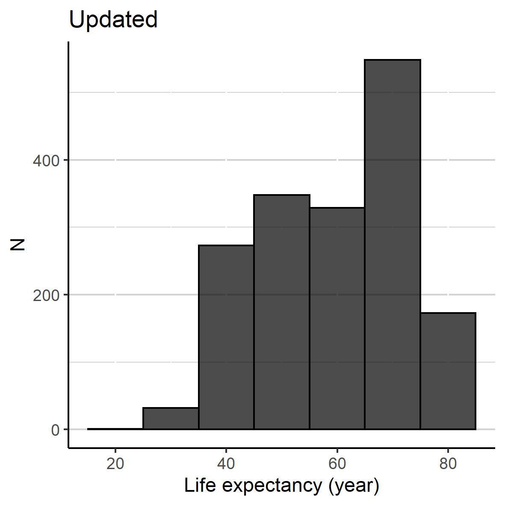

---
title: "hw05"
author: by Julie Park
date: '`r format(Sys.Date(), "%B %d, %Y")`'
output: 
  html_document:
    toc: true
---    

```{r, warning=FALSE, echo=FALSE, message=F}
library(tidyverse)
library(gapminder)
library(datasets)
library(DT) #For datatable()
library(knitr) #For kable()
library(gridExtra) #to put the figures side by side
```
<br><br>

#Exercise 1: Explain the value of the here::here package

Read through the blog post by Malcolm Barrett where he outlines why one should use the here::here package in RStudio projects.

**Task: In your own words, summarize the value of the here::here package in 250 words or fewer.**

Even though I have used R for years, I did not use `setwd()`, let alone `getwd()`.  I have defined the **entire path** where the dataset was called from or was to be saved into. To get around the issue of **using back/forward slashes** to define a path, I saved 2 paths: one for MAC and one for PC with comments so whoever runs my code knew which path to select.  Come to think of it, it was rather tedious having to define paths twice.  

My way of coding was ok until I had a client who took my code and tried to run it without success because he was not on the same server as my coworkers who I normally shared my code with.


This is where `here::here` function comes in handy.  I do not need to 

* define the entire path, which may not work always. `here()` will take care it for me by finding the project directory
* create 2 paths (one for PC and another MAC) because `here()` creates a platform-independent path


<br><br>

#Exercise 2: Factor management

**Task: Choose one dataset (of your choice) and a variable to explore.** 

I have chosen `gapminder` for the analysis.  The instructions given for this data was as follows:

**1. Drop Oceania. Filter the Gapminder data to remove observations associated with the continent of Oceania. Additionally, remove unused factor levels. Provide concrete information on the data before and after removing these rows and Oceania; address the number of rows and the levels of the affected factors.**

First, the newdata was created as instructed above:
```{r}
newdata<-gapminder %>% filter(continent!='Oceania') %>% droplevels()
```

Then, the new data were compared against the original data in terms of data size, and continent:
```{r}
sprintf("gapminder has %s observations while newdata has %s observations.",
        dim(gapminder)[1], dim(newdata)[1])


sprintf("gapminder's continent has %s levels: %s", 
        nlevels(gapminder$continent), 
        paste(levels(gapminder$continent),collapse=', '))

sprintf("newdata's continent has %s levels: %s.", 
        nlevels(newdata$continent),  
        paste(levels(newdata$continent),collapse=', ')  )

```

<br/>
**2. Reorder the levels of country or continent. Use the forcats package to change the order of the factor levels, based on summarized information of one of the quantitative variables. Consider experimenting with a summary statistic beyond the most basic choice of the mean/median. Use the forcats package in the tidyverse for this, rather than the baseR function as.factor.**

continent was reordered by maximum value of gdpPercap, and the reordered variable was defined as continent.new.  
```{r}
gapminder$continent.new<-with(gapminder, fct_reorder(continent, gdpPercap, max))

```


By using `levels` function, one can tell the order of continent.new has changed and was different from that of continent:
```{r}
sprintf("Order of continent: %s.", 
        paste(levels(gapminder$continent),collapse=', '))
sprintf("Order of continent.new: %s.", 
        paste(levels(gapminder$continent.new), collapse=', '))
```

<br/>

Also, a figure of before/after re-leveling the factor visually show that the order of the factor variable has changed.

```{r, figure.width=17, figure.height=2, exercise2}
p1<-gapminder%>% ggplot(aes(continent, gdpPercap)) + 
              geom_point()+
              labs(title='Before', subtitle='(i.e. continent in original order)')
p2<-gapminder%>% ggplot(aes(continent.new, gdpPercap)) + 
              geom_point()+
              labs(title='After', subtitle="(i.e. continent in order of max(gdpPercap))", y='')+
              scale_y_continuous(breaks=NULL, labels=NULL)

grid.arrange(p1, p2, nrow=1)
```

The *after* plot below showed continent.new was properly ordered such that Africa which had the lowest gdpPercap was on the far left, followed by Oceania and so on.


<br/><br/>

#Exercise 3: File input/output (I/O) 
**Task: Experiment with at least one of:**

 - **write_csv()/read_csv() (and/or TSV friends) **
 - **saveRDS()/readRDS()**
 - **dput()/dget()**

**You are expected to create something new, probably by filtering or grouped-summarization of your dataset (for e.g., Singer, Gapminder, or another dataset), export it to disk and then reload it back in using one of the packages above. You should use here::here() for reading in and writing out.**

gapminder file was exported as gapminder.csv using `write_csv()` and was read back into R using `read_csv()` and `here::here()`.
```{r}
write_csv(gapminder,here::here("./hw05/gapminder4hw.csv"))
gapminder4hw<-read_csv(here::here("./hw05/gapminder4hw.csv"))
```

<br/>

**With the imported data, play around with factor levels and use factors to order your data with one of your factors (i.e. non-alphabetically). For the I/O method(s) you chose, comment on whether or not your newly created file survived the round trip of writing to file then reading back in.**

This time, country was reordered by its minimum pop value, and a new variable country.new was created.
```{r}
gapminder4hw$country.new<-with(gapminder, fct_reorder(country, pop, min))
```

<br/>

To see if country.new has proper factor level, a plot was created below. Note that given 142 countries, the first 50 countries were selected for the plot for readability.  The countries were ordered in the ascending order of their mininum population value.


```{r, exercise3}
gapminder4hw %>% filter(country.new%in%levels(country.new)[1:50]) %>% ggplot(aes(country.new, pop, group=year))+
      geom_point()+
      scale_y_log10(labels=scales::comma) +
      theme(axis.text.x = element_text(angle = 90))
```

<br/>

The gapminder was properly exported and imported as back as every entry was the same as shown below.  A newly defined variable after importing back the data (i.e. country.new) had to be excluded for this comparision.

```{r}
gapminder4hw<-gapminder4hw %>% select(-country.new)
table(gapminder==gapminder4hw)
```

<br/><br/>

# Exercise 4: Visualization design
**Go back through your previous assignments and class participation activities and find figures you created prior to the last week of the course. Recreate at least one figure in light of something you learned in the recent class meetings about visualization design and color.**

**Task: Create a side-by-side plot and juxtapose your first attempt (show the original figure as-is) with a revised attempt after some time spent working on it and implementing principles of effective plotting principles. Comment and reflect on the differences.**

<br/><br/>
I've extracted a figure from HW02 (left hand side of the figure below).  
Then I worked on the background and axes to make the histrogram stand out more.  In addition, various options within `geom_historam` were used to make histograms more informative and easier to see.

```{r}
f1<-gapminder %>% ggplot(aes(x=lifeExp))+
  geom_histogram(binwidth=10,center=0)+
  labs(title='Original')

f2<-gapminder %>% ggplot(aes(x=lifeExp))+
  geom_histogram(binwidth=10,center=0, color='black', fill='black', alpha=0.7)+
  #theme_minimal()+theme_classic()+

  theme(panel.border = element_blank(), panel.background=element_blank(),
        panel.grid.major.y = element_line(colour='light grey'), 
        panel.grid.minor.y = element_line(colour='light grey'), 
        axis.line = element_line(size = 0.5, colour = "black"))+
  
  labs(title='Updated', x='Life expectancy (year)', y='N' )

grid.arrange(f1, f2, nrow=1)
```


#Exercise 5: Writing figures to file

**Task: Use ggsave() to explicitly save a plot to file. Include the exported plot as part of your repository and assignment.**

**Then, load and embed that file into your report.**

<br/>

The most recent figure was saved as Unpdate.tiff using `ggsave`.
```{r}
ggsave("Updated.jpg", width = 10, height = 10, units = "cm")

```

<br/>

Then, it was embedded to this report using md script: 
``. 

**Note to myself** Apparently, pandoc supports PNG and JPG only.  So when I first saved the file as tiff, the image was embedded successfully in my html file locally, but not when it was uploaded to github.




